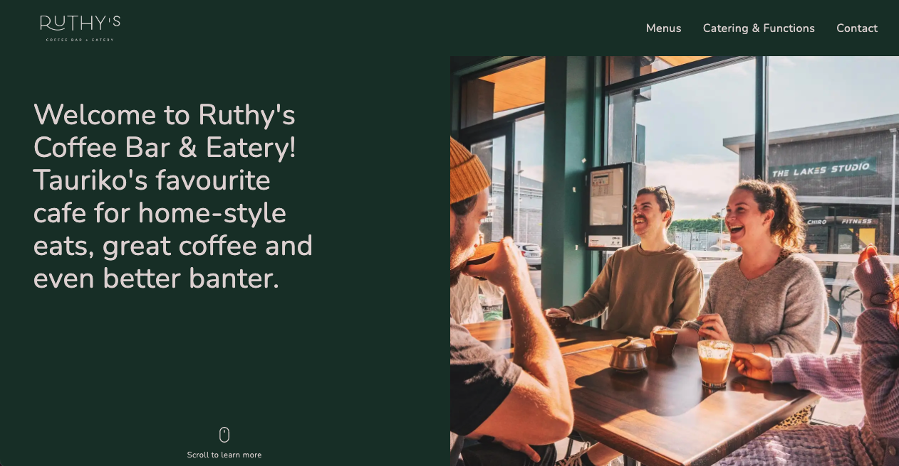

# Ruthy's Coffee Bar & Eatery Website

This is a website that I designed and coded from scratch for a local coffee shop. Find out more about my build process and learning journey below!

## Table of contents

- [Overview](#overview)
  - [The challenge](#the-challenge)
  - [Screenshot](#screenshot)
- [My process](#my-process)
  - [Built with](#built-with)
  - [What I learned](#what-i-learned)
  - [Continued development](#continued-development)
- [Author](#author)
- [Acknowledgments](#acknowledgments)

## Overview

### The challenge

I designed and coded this website for a local cafe. The business lacked a website and I felt their offerings weren't being represented effectively online.

The website takes a simple, yet clean layout to portray the several offering Ruthy's has. It includes:

- Links to their menus (both cafe and catering). Please note I haven't gained access to their menus so links are just placeholders.
- Information about their function capabilities
- Working contact form hosted on Netlify

### Screenshot

## My process

### Built with

- GatsbyJS
- SCSS
- Flexbox
- CSS Grid
- Mobile-first workflow
- Netlify to host website and contact form

### What I learned

- This website build was a great way to further my Gatsby knowledge.
- This project challenged my CSS skills in creating a responsive layout that switches between flexbox and grid at various viewports.
- One thing I learnt was the implementation of a specific hover effect on the navigation menu items. This uses `positioning` and `::after` to achieve the desired result.
- This was my first project in which I successfully implemented an SEO component from Gatsby. Previously I had been using React Helmet. The SEO component comes with some standard boilerplate code that makes implementation and customisation a breeze.
- I also learnt to overwrite the default social sharing (open graph) image to customise how the website link looks when sharing the URL on social media.

### Continued development

I'd like to continue developing my Gatsby skills. Particularly in the areas of:

- Programmatically creating pages

## Author

- Website - [Isaac Arnold](https://isaacarnold.dev/)
- Instagram - [@isaac.codes](https://www.instagram.com/isaac.codes/)
- Twitter - [@isaac_codes](https://twitter.com/isaac_codes)

## Acknowledgments

I'd acknowledge Ruthy's Facebook page which is where I sourced all my imagery for this project.
